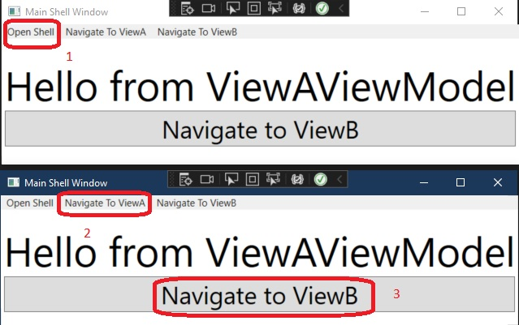
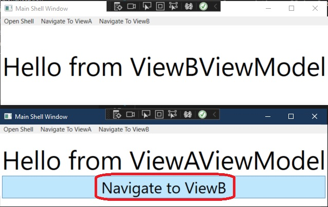

# Shows how to work with multiple shells.
- This is built from 200500-ShellRegionAware.
- This is a start example where a problem will be demonistrated which will be fixed in the subsequent example.
- This app has a problem, and this will be fixed in the subsequent example. 
- ViewA has a button when clicked should take you to ViewB.
```xml
<Button Command="{Binding NavigateCommand}" Content="Navigate to ViewB" FontSize="30" />
```
- The view model has a correponding NavigateCommand and its handler to handle the click event, and this will show ViewB.

- Now the problem. Run the app and do the following.



- Clicking the button in the second window should take that second windows to View B. But instead the first window is taken to ViewB. The reason is because the ViewAViewModel has global region manger injected into it. What it needs is the scoped region manager. 



- This will be fixed in the next example. 